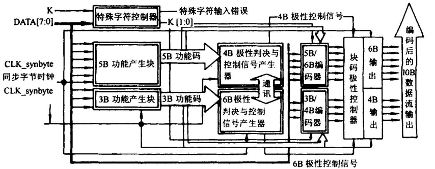

# 8B10B编码详解

--- by Andy

> HDMI使用16B/18B编码作为保证 DC 平衡 的重要工具。通过查看16B/18Bexcel表格可以发现其内容与8B/10B编码一致，而且16B/18B的原始论文和相关资料较少，所以通过学习8B/10B来理解16B/18B的工作原理。

## 前言

在高速的串行数据传输中要达到令人满意的误码率，其关键技术在于串行传输中数据的编码方法。8B/10B作为互联接口一种技术，在提出后被广泛应用到各种高速接口上。8B/10B编码最初由IBM公司的Albert X.Widemer和Peter A.Franaszek发明，并应用于 ESCON(200M互连系统)中。它是mBnB编码中的一个特例。本文将介绍该编码的原理和实现方式，最后会简单介绍该编码的优缺点。

## 8B10B码技术基础理论

> 高速接口被广泛应用于包括SATA、SAS、PCI、PCI-e等多种标准中。高速接口技术可以达到甚至超越10Gb/s，从高速接口的组成部分来看，可以知道这些接口是由三部分构成：
>
> 1. 电路部分（串行/解串行）
> 2. 物理部分（编解码）
> 3. 链路与协议部分（流量控制、纠错检错等高层协议）
>
> 物理部分要给电路部分提供稳定运行的保障。

数据在线路传输过程中会产生许多问题，从而导致数据的丢失、错误。综合来说，存在以下问题：数字序列中连续出现相同的 “0” 或 “1” ，在传输到接收端之后，会因为信号的衰减，出现难以分辨的情况。

物理部分主要任务是对数据进行编码，以保证串行/解串行器的正常运行。编码的目的包括：确保必要的变换，保证稳定的直流均衡。

编码的要求：1）编码所选择的码型不能随便的，要确保编码、解码双方都能明确其含义，相当于是编码表中各个编码不能存在歧义，要保证比特序列的独特性。2）其次，确保数据流中具有足够的边沿让接收端恢复时钟，从而不再需要分配时钟（传输过程不需要通用参考时钟），让传输实现更高的速率（串行）

## 8B10B码编码原理

8B10B码的编码方式就是将8bit的代码组合编码成10bit代码。代码组合有**256个数据字符编码**和**12个控制字符编码**，分别将其记为D.x.y和K.x.y。

### 编码方案

8B10B编码方案就是将8bit数据分成2个子分组。3个最高有效位（记为y）和5个最低有效位（记为x）。从最高有效位到最低有效位分别记为HGF和EDCBA。然后将3bit的HGF编码为4bit的代码，记为jhgf；再将5bit的EDCBA编码为6bit的代码，记为iedcba。编码原理如下图所示：

### DC平衡

编码为了保证直流平衡，有一些相关措施。

**D**（disparity，不平衡度）：在每个子分组中，通过“0”的个数减去“1”的个数计算得到D。例如：在6bit代码中，“0”的个数为4，“1”的个数为2，则 D = 4 - 2  = +2。

**RD**(running disparity，极性偏差)：编码过程中，RD表示不平衡度。RD是对编码后的数据流的统计，RD+用来表示1比0多，RD-用来表示0比1多。RD-是初始状态

> 每当对一个分组进行编码时，都需要对其计算RD。
>
> 当码字的 D == 0 时，称 该码字为完美平衡码。
>
> 如果4bit和6bit分组的“0”和“1”个数相等，称为完美直流平衡代码。

编码过程当中5B/6B编码在前而3B/4B编码在后，用于当前5B/6B编码的RD是前面一个字节编码所产生的RD(接收或发送第一个传输字符时为初始化的RD值)，而用于3B/4B编码是前面相邻的5B/6B编码所生成的RD，但是整个字节编码所生成的RD值是由3B/4B编码得到的。

不均等性的执行规则

| Previous RD | Disparity of 6 or 4 Bit Code | Disparity chosen | Next RD |
| ----------- | :--------------------------- | ---------------- | ------- |
| −1          | 0                            | 0                | −1      |
| −1          | ±2                           | +2               | +1      |
| +1          | 0                            | 0                | +1      |
| +1          | ±2                           | −2               | −1      |

### 编码表分析

1. 3bit转4bit分组中，4bit代码共有16种，而完美平衡码只有6种。相对应的原码3bit，则有8种，必然存在非完美平衡码。
2. 5bit转6bit分组中，6bit代码只有20种编码是完美平衡码，而5bit原码共有32种，必然存在非完美平衡码。
3. 编码后的4bit、6bit代码都是偶数个数。因此不存在 D == +1 或 D == -1 这两种情况。
4. 此外，经过8B/10B编码以后，**连续的“1”和“0”基本上不会超过5个**，**只有在使用comma时，才会出现**连续的5个0或1。
5. 在数据字符编码中，3b/4b编码中存在**D.x.P7**和**D.x.A7**。两种D.x.7编码和5b/6b组合时D.x.P7和D.x.A7编码必须选择一个来避免连续的5个0或1。D.x.A7用在：x=17 x=18 x=20当RD=-1时；x=11 x=13 x=14 当RD=+1时。其他情况下x.A7码不能被使用。
6. **†** 在不同表中具有不同含义：
   1. 在数据字符编码中：表示一种独特的编码规则：在D.x.y中，x=23  、x=27 、 x=29 、 x=30时，选取相对应3b/4b表中代码时，可以选取 K.x.7 编码，共同构成控制字符编码表中的后四个，即：K.23.7 、K.27.7 、K.29.7 、K.30.7。
   2. 在 7.2 详解
7. **‡** 在不同表中具有不同含义：
   1.  在数据字符编码表中，‡ 标识的代码（3b/4b表）是候补编码，可以与K.28（5b/6b表）组成**逗号码**。
   2.  在控制字符编码中 † ‡ 所标识的代码（K.28.1 K.28.5 K.28.7）是**逗号码**，用于确保数据流中的唯一性。逗号序列是用来校准用的，如果不使用K.28.7，则唯一的逗号序列11**0000 0**1xx or 00**1111 1**0xx 不会无意中出现在任何正常代码组合中的任何位上。K.28.1、K.28.5 和 K.28.7 生成的逗号符号中**包含五个连续 0 或 1** 的位序列。‡ 在实际编码中，如果K.28.7可以被使用，一种更复杂的校准规范需要†被使用，它们能组合成各种“原语”，在任何情况下多个K.28.7序列不允许被同时使用，它将导致不可探测的逗号序列。
8. 逗号码：“逗号码”，其实都是当初在规划8B/10B编码机制的时候，所谓的控制代码（Control Characters）的其中之一。8B/10B标准中使用了12个特殊的控制代码，他们能在数据中被发送，还可以组合成各种“[原语](https://www.baidu.com/s?wd=原语&tn=24004469_oem_dg&rsv_dl=gh_pl_sl_csd)”。逗号符号用于同步(在位流中查找8b/10b 码的对齐)。

补充：

1. ‡如果在实际编码中允许使用K.28.7，则需要使用比†建议的更复杂的同步模式定义，因为K.28.7与其他几个代码的组合会形成一个假的错位逗号符号重叠在两个代码上。在任何情况下，多个K.28.7代码的序列都是不允许的，因为这会导致无法检测到的错误对齐的逗号符号。
2. K.28.7  是控制字符编码里最特殊的编码，它不能是数据流中**单个bit错误**的结果。

> 分析理解：
>
> **K.28.7** 是逗号符号中唯一一个不会受到单比特错误影响的符号。在8b/10b编码中，逗号符号（comma symbols）通常用于同步和对齐数据流，以确保数据的正确解码。**单比特错误**是指在数据流中的某一位发生了单个位的改变，可能由于噪声或其他干扰引起。文中指出，K.28.7 是唯一一个逗号符号，它不会受到单比特错误的影响。这意味着无论数据流中是否发生了单个位的错误，K.28.7 逗号符号都可以被可靠地检测和识别。这一特性对于保持数据流的同步和准确性非常重要，因为它确保了即使在存在噪声或干扰的情况下，接收端仍然能够正确识别逗号符号并继续正确解码数据。因此，K.28.7 在8b/10b编码中具有一种特殊的可靠性，使其在同步和对齐方面非常有用。其他逗号符号可能会更容易受到单比特错误的干扰，但K.28.7 具有额外的稳定性，不容易受到这种错误的影响。
>
> **在8b/10b编码中使用 K.28.7 控制字符时的一些复杂情况和同步模式的定义**：
>
> 1. **如果允许使用 K.28.7 控制字符**：在某些情况下，通信系统可能允许使用 K.28.7 控制字符。这是为了特定的通信要求或应用场景。如果 K.28.7 是允许的，那么同步模式的定义需要更加复杂。
> 2. **更复杂的同步模式**：在 † 中提到的同步模式定义是基于 K.28.1 和 K.28.5 控制字符的，用于找到数据编码的边界。然而，如果允许使用 K.28.7，那么同步模式需要更复杂，因为K.28.7 和其他编码字符的组合可能会形成错误的、不对齐的逗号符号，从而影响数据的同步。“**1100000111** 0111000011”
> 3. **避免多个 K.28.7 的序列**：文本还提到，不允许在数据流中出现多个连续的 K.28.7 控制字符序列。这是因为多个 K.28.7 的序列可能导致无法检测的逗号符号错位，这会干扰数据同步和对齐。eg：K.28.7 K.28.7 K.28.7  = = “0011111000 00111**11000 00111**11000” 

## 编解器实现

> 1. 基于查找表设计编解码器，占用存储空间也非常大，实现起来逻辑比较简单
> 2. 对编码表进行分析，搞明白表格中各个表项的之间的关系，还可以对表项代码的规律进行总结，提前根据编码的D值进行划分，
> 3. 1. 特殊字符的编码有12种，每一种特殊字符RD-和RD+对应的10bit编码不同，但码值互为反码
>    2. Ｋ28.0、Ｋ28.4、Ｋ28.7、Ｋ23.7、Ｋ27.7、Ｋ29.7和Ｋ30.7是完美平衡代码。其余6种是不平衡代码。
>    3. 采用12个ＲＯＭ 单元实现，每个单元11位，其中10位是特殊字符编码，一位是代码完美平衡标志。  
> 4. 1. 5bit到 6bit编码有32种，在6bit完美平衡的代码中，只有一种（编码7）RD-和RD+对应的6bit编码不同，其余均相同
>    2. 在6bit不平衡的代码中，RD-的6bit中有 4个 “1”和 2个 “0”，并且RD+对应的6bit编码是RD-的反码 。
>    3. 用 32个ROM单元 实 现。每个单元7位，其中6位是编码值，一位是完美平衡代码标志。
> 5. 最后一组是组合6bit和4bit为10bit：要满足 1）极性偏差不能大于2  2）连续的“1”和“0”个数不能大于5。
>
> 实现步骤为：1. 判断是特殊字符还是数据字符； 2. 若是特殊字符，根据RD取值； 3.如果是数据字符，根据RD确定6bit的取值； 4.根据6bit编码值选取4bit编码值。

## 参考资料

1. WIDMER A X, FRANASZEK P A. A DC-Balanced, Partitioned-Block, 8B/10B Transmission Code[J/OL]. IBM Journal of Research and Development, 1983, 27(5): 440-451. DOI:[10.1147/rd.275.0440](https://doi.org/10.1147/rd.275.0440).
2. 李宥谋. 8B/10B编码器的设计及实现[J]. 电讯技术, 2005(6): 26-32.
3. 靳鹏. 基于FPGA的8B/10B编码器的设计与实现[J/OL]. 电子世界, 2018(8): 142-143. DOI:[10.19353/j.cnki.dzsj.2018.08.079](https://doi.org/10.19353/j.cnki.dzsj.2018.08.079).
4. 杨佩, 张丽娜, 张洵颖, 等. LVDS中8B/10B编码解码器的设计与实现[J/OL]. 微电子学与计算机, 2014, 31(5): 41-43+48. DOI:[10.19304/j.cnki.issn1000-7180.2014.05.010](https://doi.org/10.19304/j.cnki.issn1000-7180.2014.05.010).
5. [让我们来搞清楚8b/10b编码到底是怎么回事吧_bendandawugui的博客-CSDN博客](https://blog.csdn.net/dongdongnihao_/article/details/123747597)
6. [8b/10b encoding - Wikipedia](https://en.wikipedia.org/wiki/8b/10b_encoding)
7. [8B10B编解码原理与FPGA代码_8b10b编码verilog实现_＆ ＃ ＆的博客-CSDN博客](https://blog.csdn.net/qq_53281270/article/details/127771308?utm_medium=distribute.pc_relevant.none-task-blog-2~default~baidujs_baidulandingword~default-0-127771308-blog-79982486.235^v38^pc_relevant_sort_base2&spm=1001.2101.3001.4242.1&utm_relevant_index=3)
8. [高速接口知识点1：8b/10b编码原理_哔哩哔哩_bilibili](https://www.bilibili.com/video/BV1494y1R7hA/?spm_id_from=333.337.search-card.all.click&vd_source=e466977515beb5c472268009969a4ea4)
9. [8B/10B Encode/Decode详解 - 那些城市那些花 - 博客园 (cnblogs.com)](https://www.cnblogs.com/YINBin/p/11011232.html)
10. [8B/10B编码_yundanfengqing_nuc的博客-CSDN博客](https://blog.csdn.net/yundanfengqing_nuc/article/details/87967605?spm=1001.2014.3001.5506)
11. [8B/10B编码基本原理_8b10b编码原理_KSY至上主义者的博客-CSDN博客](https://blog.csdn.net/qq_37654178/article/details/112391245)