# 48Gbps传输的HDMI 2.1协议要点

> 2017年12月19日
>
> - 为了因应消费市场对于高画质影音应用需求日益增加，HDMI Forum 于 2017 年底发布了 HDMI 2.1 的最新规格，其中最令人惊艳的新功能就是加入FRL （Fixed Rate Link）的传输模式，它可以说是颠覆了以往 HDMI 接口 传送讯号的方式
>
> - HDMI 2.1 发布以前是使用TMDS （TransiTIon Minimized DifferenTIal Signaling，最小化传输差分讯号）的架构来进行讯号的传输，最高带宽可达 18Gbps，可用来传送 3840x2160p 60 等 4K 高画质影像
>
> - FRL 模式的带宽则提升到 48 Gbps，利用压缩的方式则可传送高达10K 分辨率的影像
>
> - [HDMI 2.1 FRL传输模式](https://www.cnblogs.com/amxiang/p/15963192.html)
>
>   

## 简要回顾HDMI 1.4/2.0协议

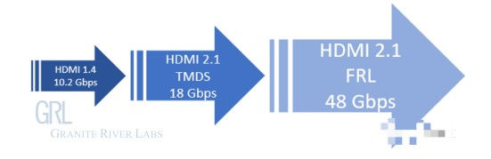

### HDMI 2.0剖析-回顾

> TMDS = 最小化差分信号传输。TMDS是一种微分信号机制，采用的是差分传动方式
>
> FRL =  Fixed Rate Link  固定比率连接
>
> DSC = (显示流压缩) 一种视觉无损压缩技术，可提供高达3:1的压缩范围
>
> eARC = 增强音频返回通道

#### TMDS模式的物理层传输编码 8b/10b

> [8b/10b编码详解](https://blog.csdn.net/dongdongnihao_/article/details/123747597)
>
> 新的FRL模式使用16b/18b的编码方式

##### 8b/10b提出原因

> 单看这个图大家可能还是不太明白为啥，解释一下，由于串行电路通常采用交流耦合的方式（串接电容）我们知道理想电容的阻抗公式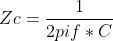 ，通过这个公式可以知道，频率f越高，阻抗越低，反之，频率越低，阻抗越高。

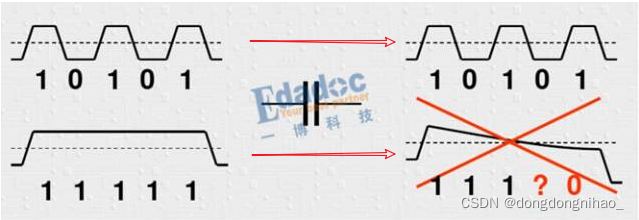

- 当码型是高频的时候，基本可以不损耗的传输过去，
- 但是当码型为连续的0或者1的时候，电容的损耗就很大，导致幅度不断降低，最严重的后果就是无法识别到底是0还是1
- 因此8b/10b编码就是为了尽量把低频的码型优化成较高频率的码型，从而降低阻抗带来的损耗

#####  8b/10b编码算法

> 8b/10编码的特性就是保证DC平衡——直流平衡。就是串行数据中连续出现的1/0达到一个平衡均匀的状态。

8b/10b编码将串行的数据以8bit为一个单位进行编码处理得到一个10bit的数据

####  TMDS原理

> 一个HDMI包括3个TMDS数据通道和1个TMDS时钟通道

*每个数据通道都通过编码算法（异或、异或非等），将8位数据转换成10位数据，前8为数据由原始信号经运算后获得，第9位指示运算的方式，第10位用来对应直流平衡。通过这种算法，会使得数据的传输和恢复更加可靠。*

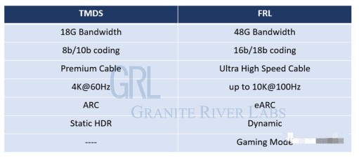

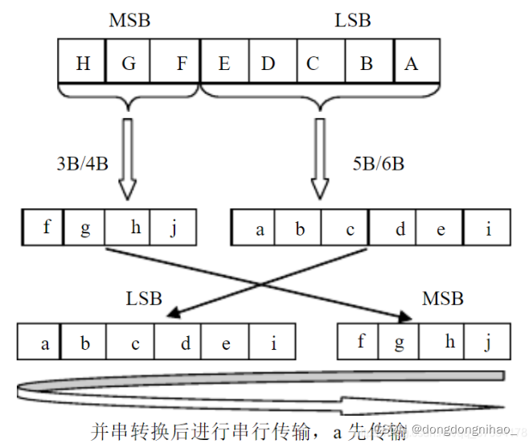

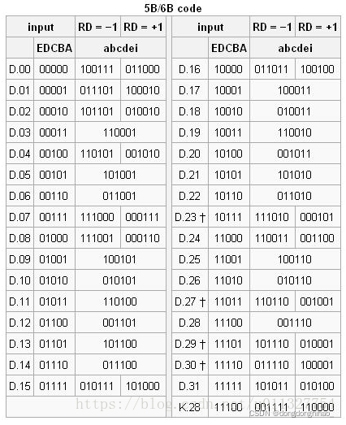

#### TMDS字符速率

> TMDS字符速率（TMDS Character Rate）指单位时间内所传输的字符数，单位是Mcsc（Mega-characters/second/channel）。
>
> 一个TMDS字符有10个比特，因此，一个tmds通道单位为：
>
> ​	tmds通道带宽 = 10 X TMDS字符速率

hdmi2.0有3个tmds通道，根据上述hdmi2.0规范，每个tmds数据通道的字符速率为600Mcsc，即每秒600M字符。

所以hdmi2.0的总带宽为：

​	hdmi总带宽 = 3 * tmds通道带宽 = 3 * 10 * tmds字符速率 = 3 * 10 *600M = 18000 M = 18 G

## HDMI 2.1特性

> 把TMDS时钟通道当成FRL模式的新数据通信通道。这样数据通道有4条。没有了时钟通道，数据通道改成了FRL（Fixed Rate Link，固定传输速率）（3Gbps、6Gbps、8Gbps、10Gbps、12Gbps）。因此HDMI2.1的最高宽带为**48Gbps**。
>

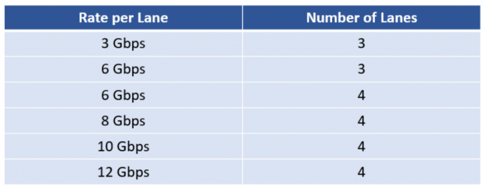

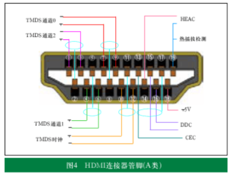

HDMI2.1 物理层使用16b/18b编码方式

那么一个字符就是18b

600MCSC的话，就是每个通道每秒传输600M字符

18*600M = 10800 Mbps = 10.8G bps

那么4个通道的话，

4 * 10.8 = 43.2 G bps

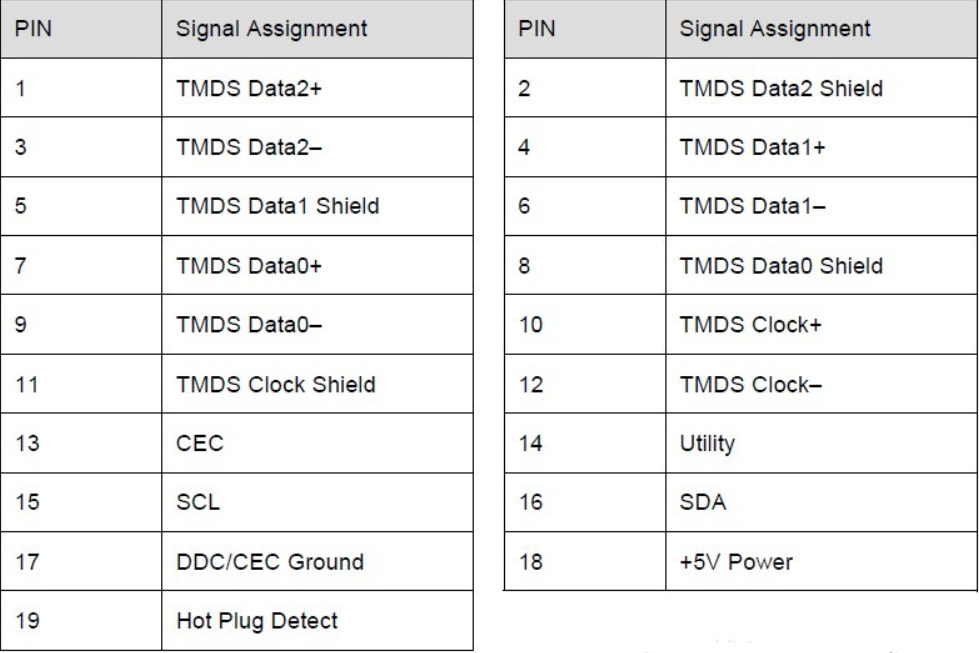

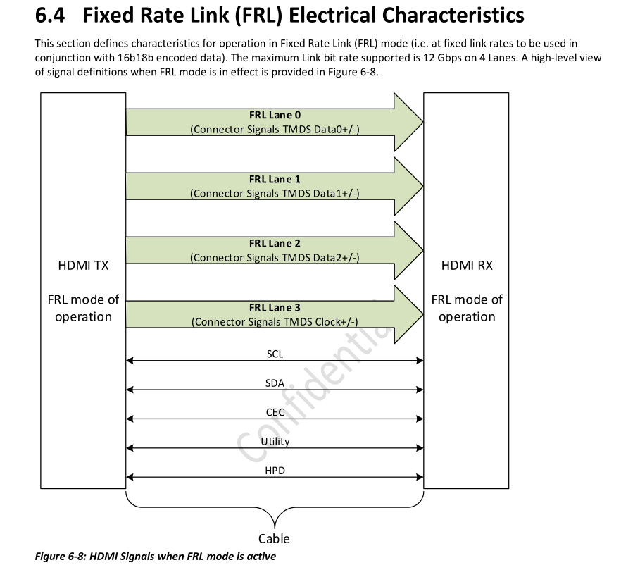

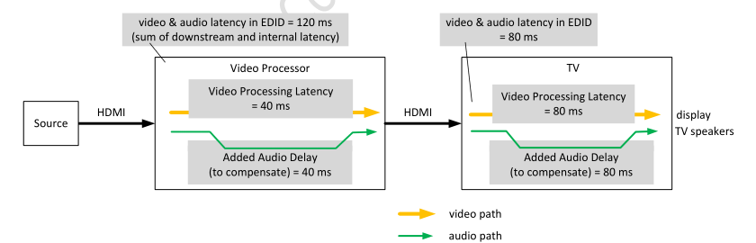

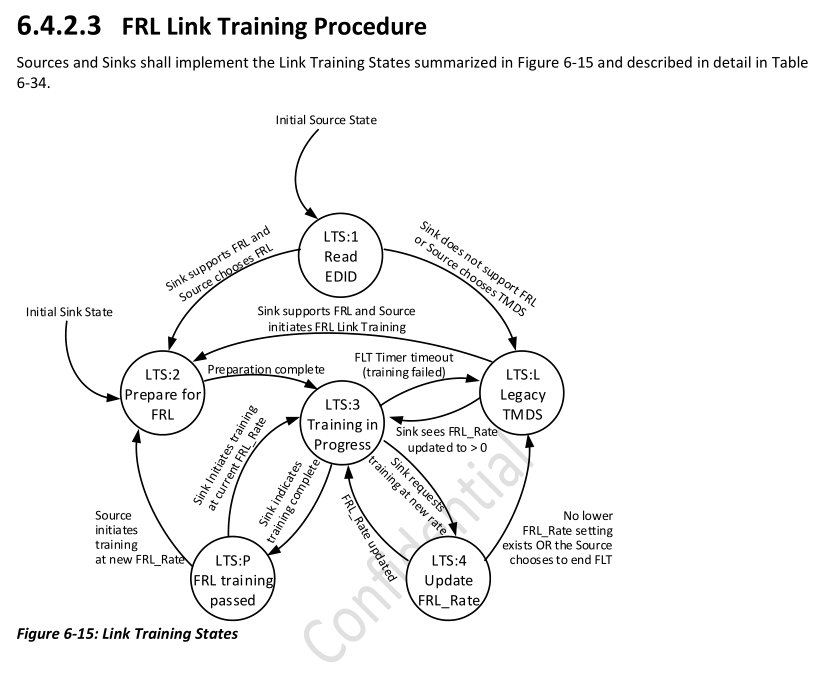

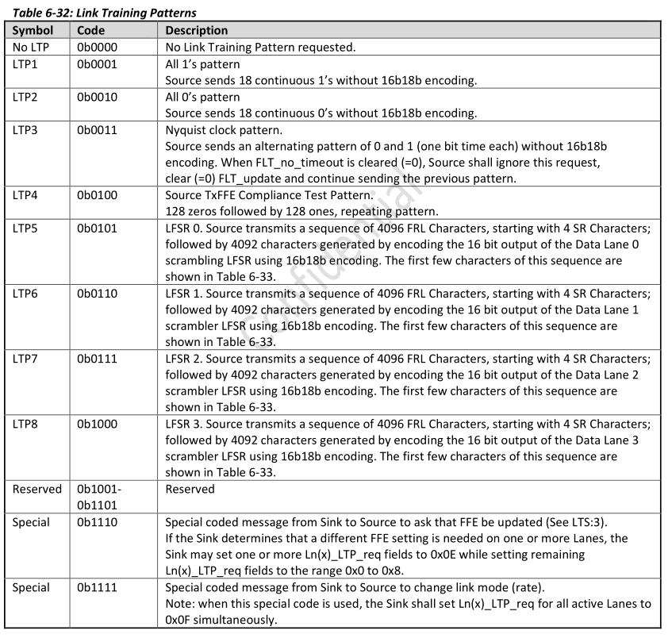

# HDMI收发数据详解

## TMDS模块框图

>  TMDS是物理层的数据传输协议
>
> 无论是DVI和HDMI都是使用TMDS作为物理层的数据传输协议，但是HDMI比DVI多个一些Auxiliary data用于传输音频数据。

Source：发送端（数据由此产生）

Sink：接收端（终端，接受传输来的数据）

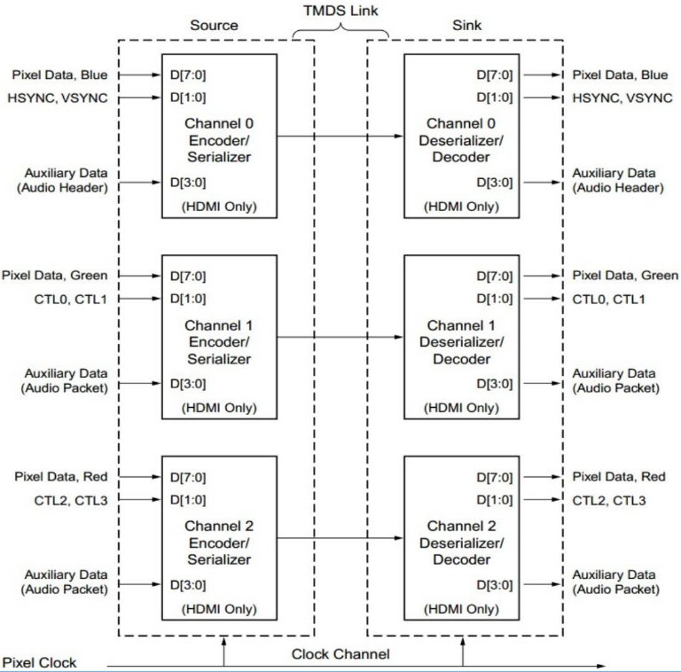

**蓝绿红三条数据通道的区别**

相同点：

- 三者都有 [7:0]8位 的数据位
- 此外蓝绿红三个通道都分别有[3:0]4位用于传输Audio（音频数据）。三个通道共计12位。（上图的auxiliary data部分）

不同点：

- 蓝色通道有两位用传输行场同步信号（HSYNC,VSYNC），而绿色和红色两个通道相对应的也有两位用于传输CTL0,CTL1,CTL2,CTL3，正常来说没有实际作用，假如发送端需要传输一些控制信号则可以使用CTL来传输。

理论上是 蓝色 绿色 红色 三条数据通道 + Pixel Clock 时钟通道 = 4条通道

时钟通道是为了使得发送端和接收端都处于一个同步信号下，使得数据传输更加稳定，错误发生概率减少。

**在实际传输的时候，发送端和接收端分别有 Encoder/Serializer（编码器/串行化器）和Deserializer/Decoder（解串器/解码器）。具体步骤如下：1）发送端将8b的数据进行编码变成10b。2）然后串行化发送。3）接收端通过解串器接收。4）解码器将10b数据还原成8b数据的原始数据。**

**从逻辑上来讲，整个TMDS协议部分就是 编码 - 并转串 - 串转并 - 解码 共四个阶段**

1. 编码阶段：编码器会将视频源中的像素数据、HDMI音频数据、CTL控制数据、行场同步数据分别编码成10b的传输数据。例如，传输时，会将8b的像素数据单独编码成10b的传输数据，此外如果有4b的音频数据会单独编码成10b的传输数据，或者有单独2b的行场同步数据也会编码位10b的传输数据。
2. 并串转换阶段：将编码后的10b字符流传输数据转换成串行数据流，通过一对差分通道进行传输。（区别于UART这种单根数据传输通道）。**PS：**值得注意的是在10：1的并转串过程所生成的串行数据速率是实际像素时钟速率的10倍。简单来说就是串行数据的速率是并行数据的10倍。因为原来1个时钟周期出来8b数据，但是传输的时候需要在原来的一个时钟周期内传输10b数据，所以串行传输的时钟是原来时钟的10倍。

## DVI编码机制

> 在每一帧图像的行与行之间、以及视频不同帧之间的时间间隔（消隐期）内，数据通道上传输的则是控制字符（行场同步数据、CTL数据）。

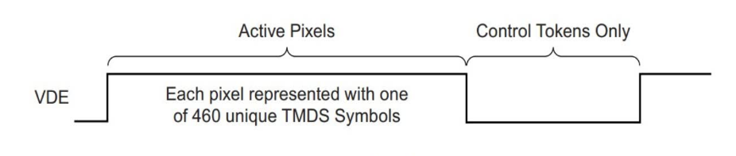

VDE信号拉低表示消隐期。

## HDMI编码机制

> HDMI传输的消隐期除了传输控制字符外，还可以用于传输音频或其他附加数据，比如字幕信息。

4-bit的音频和附加数据通过TERC4编码机制转换成10-bit TERC4字符，然后数据在绿色和红色通道传输，但是实际传输离不开蓝色通道。

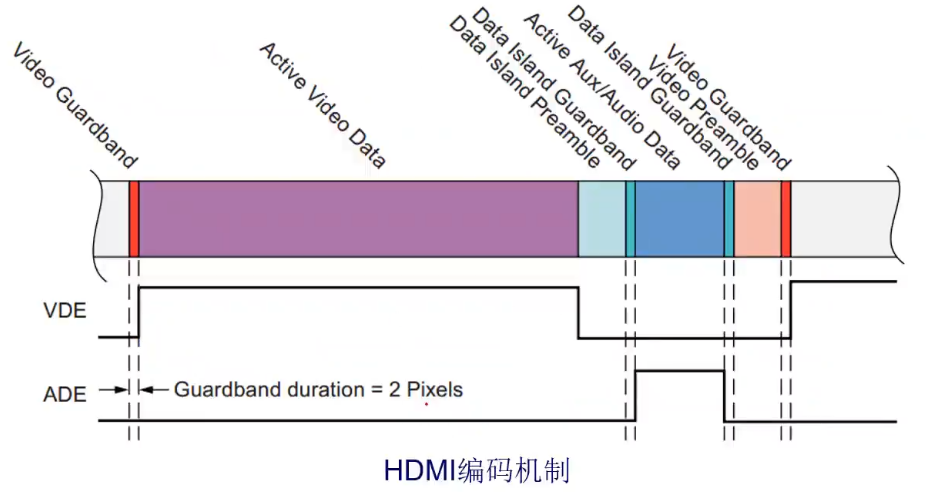

VDE拉低期间就是消隐期。

> Data Island Preamble：数据的头，序文
>
> Data Island Guardband：保护带
>
> Active Aux/Audio Data：音频、字幕等数据，在ADE信号拉高期间才能传输。

## DVI编码器

VDE用于各个通道选择输出视频像素数据还是控制数据。

HSYNC和VSYNC信号在蓝色通道进行编码得到10-bit的字符，然后在消隐期传输。

绿色和红色通道的CTL信号同样需要编码，并在消隐期传输。

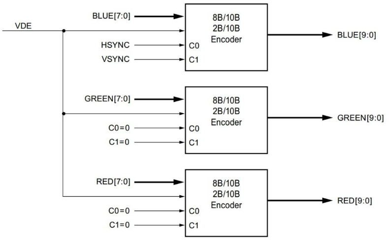

PS：在实际编写代码时候则是需要使用Verilog硬件描述语言将上图的编码器实现出来。

## TMDS编码算法

> 每个编码器工作的时候都需要使用TMDS编码算法将8-bit数据编码成10-bit的传输字符。
>
> TMDS和LVDS、TTL相比有较好的电磁兼容性能。
>
> 这种算法可以减小传输信号过程的上冲和下冲；（上冲下冲就是高低电平的转换）
>
> 而DC平衡使信号对传输线的电磁干扰减少；（DC平衡就是使得在一个10-bit的字符中0和1的个数接近相等，避免一个字符中出现9个1和1个0这种极端情况）
>
> 可以用低成本的专用电缆实现长距离、高质量的数字信号传输。

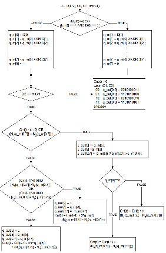

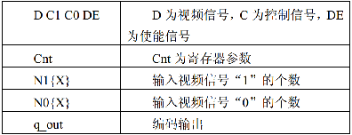

TMDS编码算法流程图

特点：

1. 每个通道8-bit的像素数据都将被转换成460个特定10-bit字符中的一个。

2. 这个编码机制*大致*上实现了传输过程中的直流平衡，即一段时间内传输的高电平（数字“1”）的个数大致等于低电平（数字“0”）的个数。

3. 每个编码后的10-bit字符中状态跳转（“由1到0”或者“由0到1”）的次数将被限制在五次以内。
4. 每个通道2-bit控制信号的状态也要进行编码，编码后分别对应四个不同的10-bit控制字符，分别是10'b1101010100，10'b0010101011，10'b0101010100，和10'b1010101011。每个控制字符都有七次以上的状态跳转。
5. 视频字符和控制字符状态跳转次数的不同将会被用于发送和接收设备的同步。

## HDMI模块框图

> HDMI的发送端和接收端都有HDMI的发送器和接收器；HDMI的发送器和接收器都是基于TMDS协议所构建，此外HDMI的发送端和接收端还多了CEC和EDID。

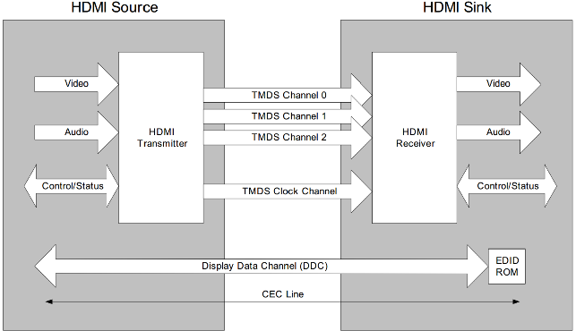

- CEC：Consumer Electronics Control用户电气控制

- EDID：Extended Display Identification Data扩展显示标识数据

**DDC和CEC通道详解**：

- DDC：是发送端和接收端的交互通道，发送端和接收端建立联系之后，接收端会通过该通道告诉发送端一些信息：接收端能接收的视频分辨率，刷新率，数据格式（颜色数据格式如RGB4:4:4）等等。

- EDID：接收端能接收的视频分辨率，刷新率，数据格式（颜色数据格式如RGB4:4:4）等等信息都存储在EDID中。相当于人的身份证。且，EDID是一个数据矩阵。
- CEC：是一个必须保留的接口但是可以不实现，不常用。在工业上较为常用。

## HDMI物理引脚定义

> HDMI的A型接口最为常见，是一个19pin的接口。

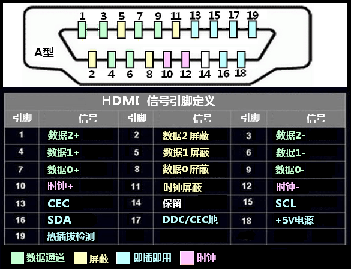

- 15 SCL和 16 SDA是IIC协议信号线，在需要IIC协议的时候可以使用这两个引脚。

- 19 热插拔检测，可以命名位HPD，非常重要。在接好HDMI线路后，发送端会把HPD拉高，发送端就知道接收端准备好了，然后才开始发送数据。此外，HDMI接口是
- 在实际中，HDMI是全双工的数据线，如何判断哪方为Source，哪方为Sink？通过查看硬件设计图来编写代码决定。

# 收发器

Customizing and Generating the Core
This section includes information about using Xilinx tools to customize and generate the 
core in the Vivado Design Suite.
You can customize the Wizard IP core for use in your design by specifying values for the 
various parameters associated with the core using these steps:
1. In the Vivado Design Suite, create a new project or open an existing project that is 
configured to target one of the supported UltraScale™ or UltraScale+™ devices.
IMPORTANT: It is important to choose the exact part because characteristics such as speed grade, 
temperature grade, and silicon level affect the available features and performance limits of the serial 
transceivers. Limitations based on device characteristics are represented by the available choices when 
customizing the Wizard IP in the Vivado Integrated Design Environment (IDE).
2. Open the IP Catalog and select the IP at FPGA Features and Design > I/O Interfaces > 
UltraScale FPGAs Transceivers Wizard.
3. Double-click the IP or select the Customize IP command from the toolbar or right-click 
menu to display the Wizard Customize IP dialog box.
Note: This core is not available in the Vivado IP integrator.
For details, see the Vivado Design Suite User Guide: Designing with IP (UG896) [Ref 8].

Note: Figures in this chapter are illustrations of the Vivado IDE. This layout might vary from the 
current version.

本节包括有关在Vivado Design Suite中使用Xilinx工具自定义和生成核心的信息。

你可以自定义向导IP核，在你的设计中使用，通过以下步骤为与核心相关的各种参数指定值:在Vivado设计套件中，创建一个新项目或打开一个现有项目，该项目被配置为针对受支持的UltraScale™或UltraScale+™设备之一。

重要:选择准确的部件非常重要，因为速度等级、温度等级和硅级等特性会影响串行收发器的可用特性和性能限制。在Vivado集成设计环境(IDE)中定制向导IP时，基于设备特性的限制由可用的选择表示。

\2. 打开IP目录，在“FPGA Features and Design > I/O Interfaces > UltraScale FPGA Transceivers Wizard”中选择IP。

3.双击IP或在工具栏或右键菜单中选择“自定义IP”命令，弹出“向导自定义IP”对话框。

注意:这个核心在Vivado IP集成器中不可用。

有关详细信息，请参见Vivado Design Suite用户指南:使用IP进行设计(UG896)[参考8]。

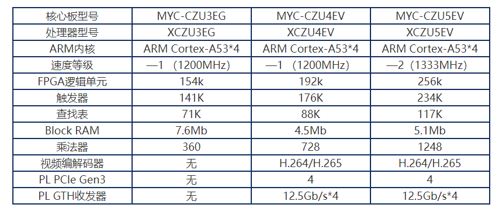

GTH收发器：[VIVADO IP核：GTH高速收发器（时钟） - 知乎 (zhihu.com)](https://zhuanlan.zhihu.com/p/560622459)

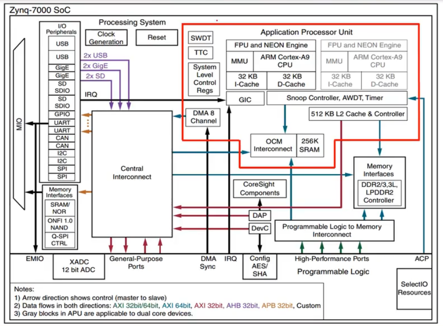

Stream 是视频相关接口

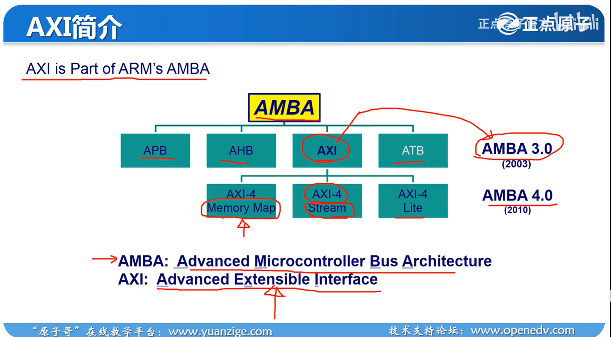

Zynq U+ MPSoC  EV 系统框图

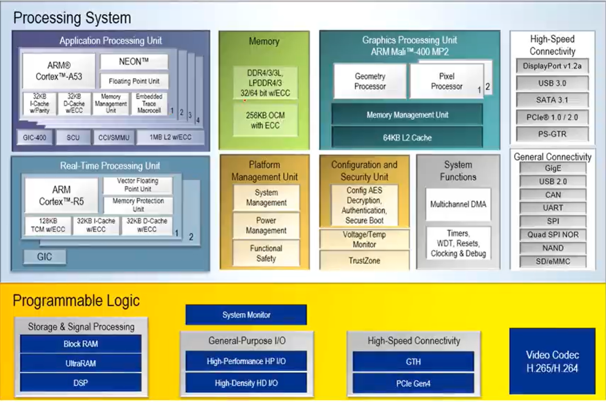
